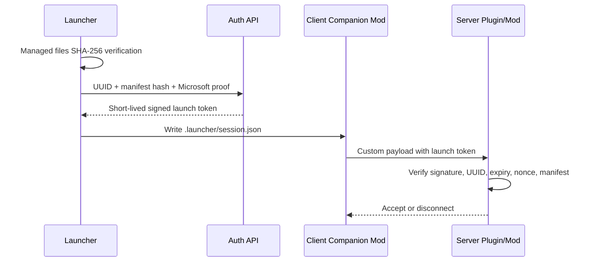

# 전용 런처 접속 보안 설계

## 보안 한계

런처 프로세스가 로컬 파일을 검사했다는 사실만으로 서버는 그 결과를 신뢰할 수
없습니다. 공격자는 런처를 수정하거나, 검사가 끝난 뒤 파일 또는 메모리를 바꾸거나,
일반 런처에서 동일한 접속 패킷을 재현할 수 있습니다.

따라서 이 프로젝트의 `strictMode`는 실수로 잘못된 모드를 넣는 상황과 단순 변조를
차단하는 기능입니다. 강한 접근 통제는 반드시 서버 측 검증이 필요합니다.

## 권장 구성



## 런처 인증 API

`launcher-config.json`의 `security.launcherHandshakeUrl`을 설정하면 게임 실행 직전
다음 JSON을 POST로 보냅니다.

요청 헤더:

```http
Authorization: Bearer <Minecraft access token>
Content-Type: application/json
```

요청 본문:

```json
{
  "uuid": "player-uuid",
  "playerName": "PlayerName",
  "manifestVersion": "2026.06.13-1",
  "manifestSha256": "sha256-of-managed-file-list",
  "issuedAt": "2026-06-13T00:00:00.000Z",
  "expiresAt": "2026-06-13T00:02:00.000Z"
}
```

API는 Minecraft Services에서 계정 토큰과 UUID 소유 관계를 확인한 뒤 짧은 수명의
서명 토큰을 반환해야 합니다.

응답 예:

```json
{
  "token": "<signed-jwt-or-paseto>",
  "nonce": "<one-time-random-value>"
}
```

응답은 게임 폴더의 `.launcher/session.json`에 저장됩니다.

## 클라이언트 동반 모드

서버의 로더와 같은 Fabric/Forge/NeoForge 모드를 하나 배포해야 합니다.

동반 모드 역할:

- `.launcher/session.json` 읽기
- 로그인 직후 서버 전용 custom payload 채널로 토큰 전송
- 서버의 challenge nonce에 응답
- 제한 시간 안에 인증하지 못하면 접속 중단

JVM 시스템 속성 `servercraft.session`에도 세션 파일 경로가 전달됩니다.

## 서버 플러그인 또는 서버 모드

서버 측 역할:

- 접속 후 짧은 제한 시간 동안 플레이어 이동과 상호작용 정지
- 토큰 서명, `aud`, `iss`, UUID, 만료 시간 검증
- nonce 1회 사용 보장
- 허용된 manifest 버전 및 해시 확인
- 인증 실패 또는 동반 모드 미설치 접속 종료

프록시를 사용한다면 최종 백엔드 서버가 아닌 Velocity/BungeeCord 진입점에서
인증 상태를 공유하거나 검증해야 우회 접속을 막을 수 있습니다.

## 핵과 엑스레이 대응

파일 허용 목록만으로 모든 치트를 차단할 수 없습니다.

함께 적용할 항목:

- 서버 측 안티치트
- Paper/Purpur의 패킷 및 월드 난독화 설정
- 네트워크 레벨 직접 접속 차단
- 최소 권한 운영과 관리자 계정 2단계 인증
- 런처와 동반 모드 코드 서명
- manifest 및 세션 토큰의 비대칭 서명
- 서버 로그에서 토큰 재사용과 비정상 접속 탐지

리소스팩 기반 엑스레이는 strict manifest로 상당 부분 제한할 수 있지만, 셰이더,
GPU 후처리, 메모리 변조, 외부 오버레이까지 런처가 완전히 통제할 수는 없습니다.
